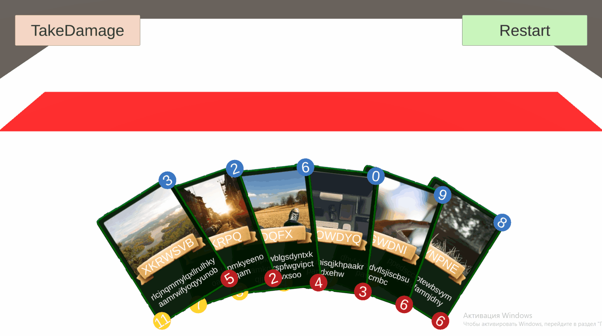

# RedRift_UnityTest_GorbachevArtem
Тестовое задание для комапнии RedRift

Детали задания:
1. Create UI for an "in-hand card" object for CCG-like game. Card consist of:
* Art + UI overlay
* Title
* Description
* Attack icon + text value
* HP icon + text value
* Mana icon + text value
2. Load card art randomly from https://picsum.photos/ each time app starts.
3. Fill player’s hand with 4-6 (6 in my realization) cards in a visually pleasing way and use the arc pattern for displaying the cards (look at the pic below). The number of cards should be determined randomly at the start of the game.
4. Create an UI button at the center of the screen to randomly change one randomly selected value -2→9 (the range is from -2 to 9) of each one card sequentially, starting from the most left card in the player's hand moving right and repeating the sequence after reaching the most right card.
5. Bind Attack, Health and mana properties to UI. Changing those values from code must be reflected on the card's UI with counter animation. (counting from the initial to the new value) 
6. If some card’s HP drop below 1 - remove this card from player’s hand. (dont forget to     reposition other cards, use tweens to make it smooth)
[Больше информации]( https://doc.clickup.com/4554831/d/h/4b02f-8681/3cf4ad82d7b08e2)

  

# Структура проекта:
|-- Assets
  |-- Data
  |-- Plugins
  |-- Prefabs
  |-- Resources
  |-- Sandbox
  |-- Scenes
  |-- Scripts
  |-- Sprites

# Срок выполнения:
Около 5-и дней

# Плагины:
* DOTween
* TextMeshPro
* UniTask
